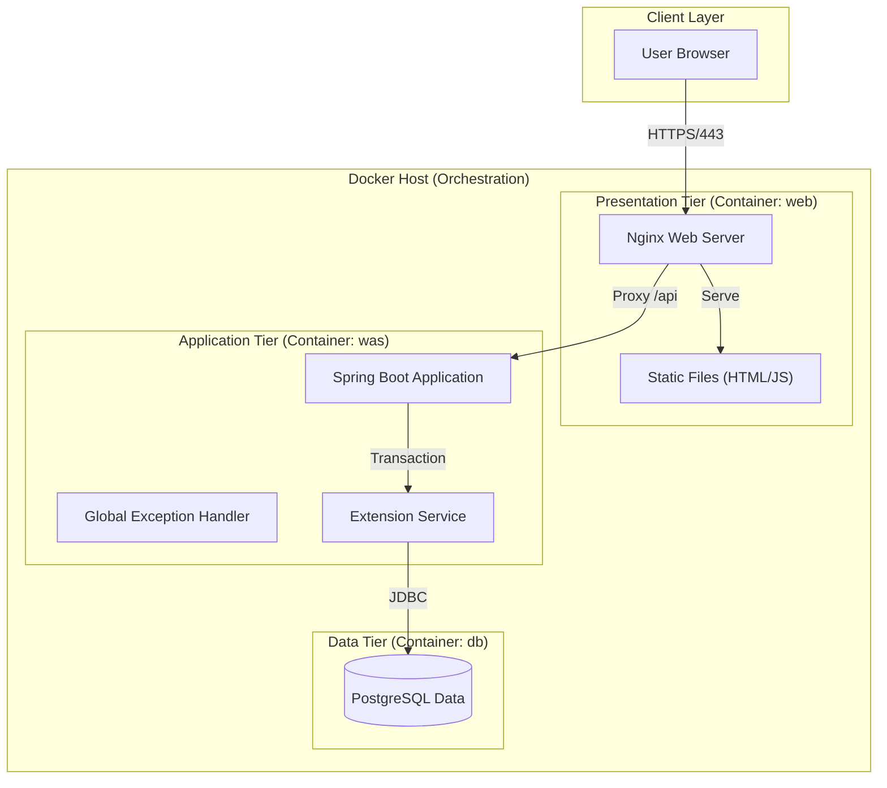
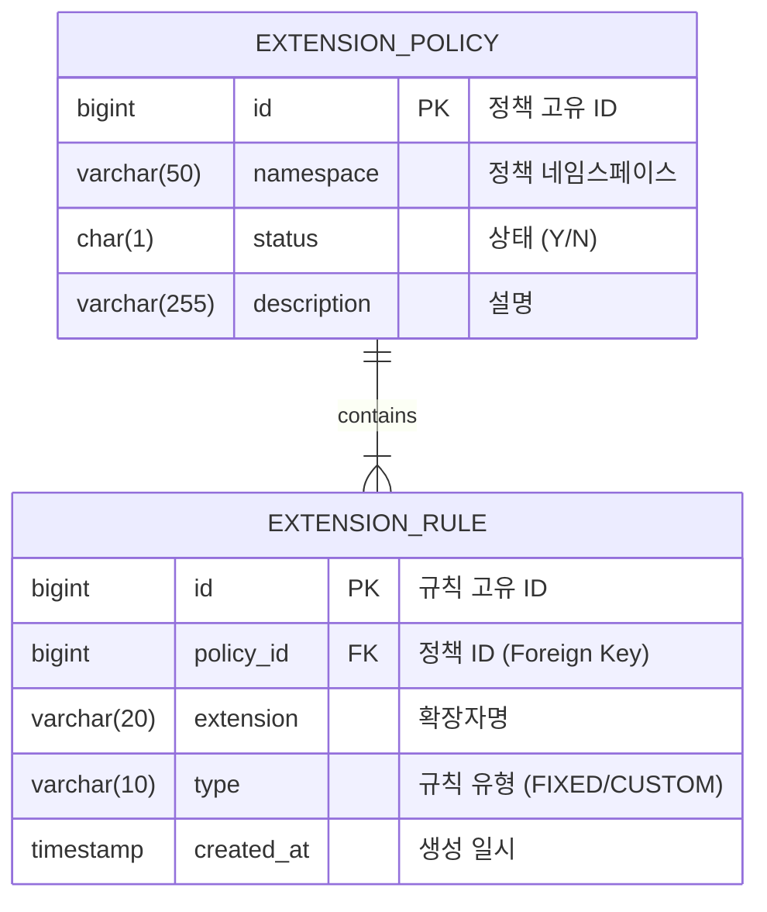

# 🛡️ 파일 확장자 차단 서비스 (File Extension Blocking Service)


## 📖 프로젝트 개요
**파일 확장자 차단 서비스**는 기업 내 파일 공유 환경(채팅, 메일, 결재 등)에서 발생할 수 있는 보안 위협을 원천 차단하기 위한 **보안 미들웨어 시스템**입니다.
관리자가 정의한 정책에 따라 특정 파일 확장자(예: 실행 파일 `.exe`, 스크립트 `.sh`)의 업로드를 제한하며, **네임스페이스(Namespace)** 개념을 도입하여 서비스별로 독립된 차단 정책을 운용할 수 있습니다.

본 프로젝트는 **안정성**, **확장성**, **보안성**을 최우선으로 고려하여 설계되었으며, **Docker 기반의 3-Tier 아키텍처**로 구성되어 배포와 운영이 용이합니다.

---

## 🚀 주요 기능 (Key Features)

### 1️⃣ 동적 차단 정책 관리
확장자 차단 규칙을 **고정(Fixed)**과 **커스텀(Custom)** 두 가지 유연한 방식으로 관리합니다.
- **고정 확장자 (Fixed Extension)**: 자주 차단되는 위험 확장자(bat, cmd, exe 등)를 미리 정의하여 체크박스로 간편하게 On/Off 할 수 있습니다. (DB 초기화 시 기본 데이터 제공)
- **커스텀 확장자 (Custom Extension)**: 관리자가 직접 최대 200개까지 추가할 수 있는 확장자입니다. 입력 즉시 유효성 검사(영문 소문자, 길이 제한)가 수행됩니다.

### 2️⃣ 멀티 테넌시 지원 (Namespaces)
단일 서버에서 여러 서비스의 정책을 분리하여 관리할 수 있습니다.
- 예: `chat`(사내 메신저) 정책과 `work`(업무 협업 툴) 정책을 독립적으로 설정 가능.
- API 호출 시 URL Path로 네임스페이스를 구분 (`/api/policies/{namespace}`).

### 3️⃣ 실시간 파일 검증
파일 업로드 시 서버에서 정책을 실시간으로 조회하여 허용 여부를 판단합니다.
- 프론트엔드에서 1차 검증, 백엔드 API에서 2차 검증을 수행하는 **이중 방어 체계** 구축.

### 4️⃣ 견고한 예외 처리 및 피드백
- **Global Exception Handling**: 모든 예외 상황(중복 등록, 제한 초과, 잘못된 입력)에 대해 표준화된 JSON 에러 응답(`E001`, `E002` 등 ErrorCode 포함)을 반환합니다.
- **User Feedback**: 백엔드 에러 메시지를 프론트엔드에서 파싱하여 사용자에게 구체적인 실패 사유(예: "이미 등록된 확장자입니다")를 알림창으로 제공합니다.

---

## 🏗️ 시스템 아키텍처 (System Architecture)

본 시스템은 **Docker Compose**를 오케스트레이터로 사용하여 **Web - WAS - DB**의 3계층 구조를 완벽하게 격리 및 통합 관리합니다.



### 아키텍처 세부 구성
| 컴포넌트 | 컨테이너명 | 기술 스택 | 주요 역할 |
|---|---|---|---|
| **Web Server** | `extension-web` | **Nginx** (Alpine) | - 정적 리소스 서빙 (SPA)<br>- HTTPS/SSL Termination<br>- 백엔드로의 리버스 프록시 (Load Balancing 준비) |
| **App Server** | `extension-was` | **Spring Boot 3** (Java 17) | - RESTful API 제공<br>- 비즈니스 로직 및 트랜잭션 처리<br>- MyBatis를 이용한 데이터 매핑 |
| **Database** | `extension-db` | **PostgreSQL** 15 | - 확장자 정책 및 규칙의 영구 저장<br>- 관계형 데이터 무결성 보장 (FK, Unique Constraints) |

---

## 💾 데이터베이스 설계 (ERD)

데이터 무결성을 위해 정규화된 테이블 설계를 적용하였으며, 정책(`POLICY`)과 규칙(`RULE`)을 1:N 관계로 모델링하였습니다.



### 주요 제약 조건 (Constraints)
1.  **Prevent Duplicates**: `extension_rule` 테이블에서 `(policy_id, extension_name)` 복합 유니크 제약조건을 설정하여, 하나의 정책 내에서 동일한 확장자가 중복 등록되는 것을 DB 레벨에서 차단합니다.
2.  **Cascade Delete**: 정책 삭제 시 해당 정책에 속한 모든 규칙도 함께 삭제됩니다.

---

## 🌐 API 명세 (API Reference)

| Method | Endpoint | Description | Request Body | Response |
|---|---|---|---|---|
| `GET` | `/api/policies/{namespace}` | 정책 조회 | - | `{ "fixed": [], "custom": [] }` |
| `POST` | `/api/policies/{namespace}/fixed` | 고정 확장자 토글 | `{ "extension": "exe" }` | `200 OK` |
| `POST` | `/api/policies/{namespace}/custom` | 커스텀 확장자 추가 | `{ "extension": "sh" }` | `200 OK` or `ErrorResponse` |
| `DELETE` | `/api/extensions/{id}` | 확장자 삭제 | - | `200 OK` |
| `POST` | `/api/validate/file` | 파일 유효성 검사 | `{ "filename": "test.exe", "namespace": "..." }` | `{ "allowed": false, "reason": "..." }` |

---

## 설치 및 실행 (Getting Started)

이 프로젝트는 Docker 환경에서 즉시 실행 가능하도록 구성되어 있습니다.

### 사전 요구 사항
- **Docker Engine** 및 **Docker Compose** 가 설치되어 있어야 합니다.

### 1단계: 프로젝트 클론 및 이동
```bash
git clone https://github.com/your-repo/extension-blocker.git
cd extension-blocker
```

### 2단계: 서비스 실행
Docker Compose를 사용하여 전체 서비스를 빌드하고 실행합니다.
```bash
docker compose up -d --build
```
*   `--build`: 소스 변경 사항이 있을 경우 이미지를 새로 빌드합니다.
*   `-d`: 백그라운드 모드로 실행합니다.

### 3단계: 접속 확인
브라우저를 열고 다음 주소로 접속합니다.
- **Web Console**: [http://localhost](http://localhost)

### 4단계: 서비스 종료
```bash
docker compose down
```
데이터까지 완전히 초기화하려면 `-v` 옵션을 추가하세요: `docker compose down -v`

